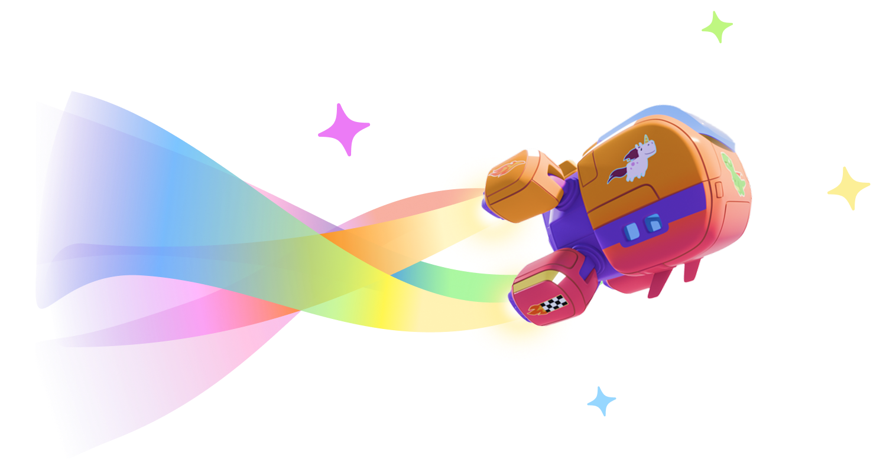

# Nurture Unity MCP Server (NUPS) 💜

> A Model Context Protocol server for Unity



## Key Features

- 🖼️ **Multimodal**: Your agent (with supported models) can see the Scene View, look through any camera in the scene, and watch play mode. It can also see thumbnails of your model assets.

- 🔎 **Superhuman Search**: Automates the Search panel to perform a converged search in the hierarchy and project assets. This is much more powerful than searching in the Project panel.

- ✔️ **Better Code Linting**: The MCP analyzes your Unity classes using Unity's compiler. This is more accurate than the compiler in your coding agent.

- ⏩ **Simple Setup**: Just configure your `mcp.json` and you are all set.

- 🛠️ **Extensible**: Minimal boilerplate to add your own tools.

- 📅 **Current**: Frequently updated to supprot the latest MCP protocol version — currently `2025-06-18` via the [Official MCP C# SDK](https://github.com/modelcontextprotocol/csharp-sdk).

## Compatibility

| Name                  | Compatible | Notes                                                                 |
| --------------------- | ---------- | --------------------------------------------------------------------- |
| **Models**            |            |                                                                       |
| GPT-4.1               | ✅         |                                                                       |
| Claude 4 Sonnet       | ✅         |                                                                       |
| Claude 4 Opus         | ✅         |                                                                       |
| Gemini 2.5 Pro        | ✅         |                                                                       |
| Gemini 2.5 Flash      | ✅         |                                                                       |
| o3                    | ✅         | No image understanding                                                |
| o4-mini               | ✅         |                                                                       |
| **Unity Versions**    |            |                                                                       |
| Unity 6000.0.x        | ✅         | Higher versions should be fine. Lower versions may work but untested. |
| **Agents**            |            |                                                                       |
| Cursor                | ✅         |                                                                       |
| Rider AI              | ✅         |                                                                       |
| Claude Desktop        | ✅         |                                                                       |
| Claude Code           | ❌         | Hangs on tool calls                                                   |
| **Operating Systems** |            |                                                                       |
| Windows               | ✅         |                                                                       |
| Mac                   | ✅         |                                                                       |
| Ubuntu                | ❔         | Untested                                                              |

## Setup

### 1. Install [node.js](https://nodejs.org/en/download)

### 2. Configure `mcp.json`

```
{
  "mcpServers": {
    "unity": {
      "command": "npx -y @nurture-tech/unity-mcp-runner",
      "args": [
        "-unityPath",
        "<path to unity editor>",
        "-projectPath",
        "<path to unity project>"
      ]
    }
  }
}
```

This will automatically install the `is.nurture.mcp` package in your unity project. Feel free to commit those changes to source control.

## About the Tools

> Meet your Unity AI toolbox.

| Tool                              | Description                                                                                            |
| --------------------------------- | ------------------------------------------------------------------------------------------------------ |
| **Assets**                        |                                                                                                        |
| `Get Asset Contents`              | Get the full contents of an asset or sub-asset.                                                        |
| `Copy Asset`                      | Copy an asset to a new path.                                                                           |
| `Import Asset`                    | Import an asset from the filesystem into Unity.                                                        |
| `Get Asset Importer Settings`     | Get the importer settings for an asset.                                                                |
| **Prefabs**                       |                                                                                                        |
| `Open Prefab`                     | Open a Unity prefab in isolation mode so that it can be edited.                                        |
| **Scenes**                        |                                                                                                        |
| `Open Scene`                      | Open a scene                                                                                           |
| `Close Scene`                     | Close an open scene                                                                                    |
| `Save Scene`                      | Save the current scene. If the scene is not dirty, this will do nothing.                               |
| `Get GameObject in Active Scenes` | Get the details of a game object in a loaded scene or prefab by its hierarchy path.                    |
| `Test Active Scene`               | Test the active scene by entering play mode and running for a given number of seconds.                 |
| **Scripting**                     |                                                                                                        |
| `Create Script`                   | Create or replace a C# code file at the given path. This also checks to make sure the script compiles. |
| `Execute Code`                    | Execute code inside the Unity editor.                                                                  |
| `Get Type Info`                   | Get public fields and methods on a Unity fully qualified type name, including the assembly.            |
| **Search**                        |                                                                                                        |
| `Search Objects`                  | Search project assets and scene objects.                                                               |
| **Editor State**                  |                                                                                                        |
| `Get State`                       | Get the state of the Unity Editor.                                                                     |
| `Get Selection`                   | Get the objects the user has currently selected in the editor.                                         |
| **Vision**                        |                                                                                                        |
| `Focus on Game Object`            | Focus on a game object in the scene view.                                                              |
| `Take Scene View Screenshot`      | Retrieve a preview of what is focused in the scene view.                                               |

## Known Issues

- The Google External Dependency Manager (EDMU) causes Unity to hang forever on startup when launched via Cursor on Windows. This is under investigation.

- Claude Code hangs on tool calls.

## Adding Project-Specific Tools

NUPS uses the official [C# MCP SDK](https://github.com/modelcontextprotocol/csharp-sdk).

1. Create a static class to hold your tools. Add the `[McpServerToolType]` annotation to the class.

2. Declare static methods to implement each tool. Add the `[McpServerTool]` annotation to each method.

3. Reference the [Services](./packages/unity/Editor/Services) directory for examples.

4. You will likely need to quit unity and restart your agent in order for it to see the new tools.

## Usage Tips

Here are some tips to get the most out of NUPS:

- 🚀 **Launch through your agent**: Always launch Unity through your AI agent's MCP integration. Launching Unity from the Hub will prevent the MCP server from connecting.

- 📂 **Per-project setup**: If your agent supports it, configure the MCP server in your per-project settings. This allows you to seamlessly switch between Unity projects.

- ⚙️ **Command-line arguments**: You can pass additional arguments to Unity for advanced scenarios like running in `-batchmode` or `-nographics` for CI/CD pipelines. Add a `--` separator before the Unity-specific arguments:

  ```json
  {
    "mcpServers": {
      "unity": {
        "command": "npx -y @nurture-tech/unity-mcp-runner",
        "args": ["-unityPath", "<path to unity editor>", "-projectPath", ".", "--", "-batchmode", "-nographics"]
      }
    }
  }
  ```

- ⚠️ **Important**: Do not use the `-logFile` command-line argument. The MCP server relies on Unity's standard output for communication.

- 🖥️ **Split screen for vision**: For tools like `Take Scene View Screenshot`, ensure the Unity editor is visible on your screen otherwise it will end up screenshotting the foreground window.
