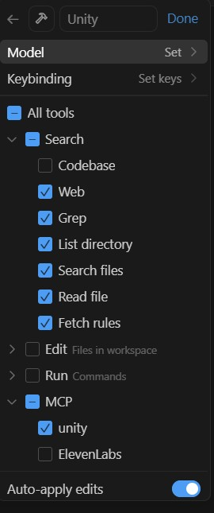
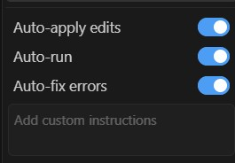

# Nurture Unity MCP Server

> A set of Model Context Protocol server components for Unity

## Compatible Models
- Claude 3.7*
- Gemini 2.0, 2.5*
- Deepseek v3, r1
- gpt-4o, gpt-4.1, o1, o3, o4
- grok-3

* Supports image interpretation based on testing. Use these models to manipulate visuals where it can benefit from visual feedback of what's in the scene.

## Configuring Unity

### Install the Package in Unity Package Manager.

1. Open the Unity Package Manager window.
2. Choose **+** -> **Install package from Git URL**,
3. Enter `https://github.com/nurture-tech/unity-mcp-playground.git#main`.
4. Click **Install**.

## Configuring Cursor

### Configure `mcp.json`.

Add to or create `.cursor/mcp.json`:

```
{
  "mcpServers": {
    "unity": {
      "type": "sse",
      "url": "http://localhost:5000/sse",
      "messageEndpoint": "/message"
    }
  }
}
```

### Configuring a Custom Cursor Agent

1. Open Cursor settings (Ctrl+Comma or Cmd+Comma).
2. Navigate to the "Features" -> "Agent" section.
3. Click "Add Custom Model".
4. Configure the model provider details as shown below:



5. Configure the advanced settings like this:




## Usage Tips

* Split your desktop with your chat agent on one side and the unity editor on the other side. The unity editor needs to be visible on screen or else the `screenshot` tool will fail to see the scene view.

* The MCP server has some overhead in the Unity Editor. To turn off MCP for some time, add `NO_MCP` to the **Scripting Define Symbols** in **Player Settings**.